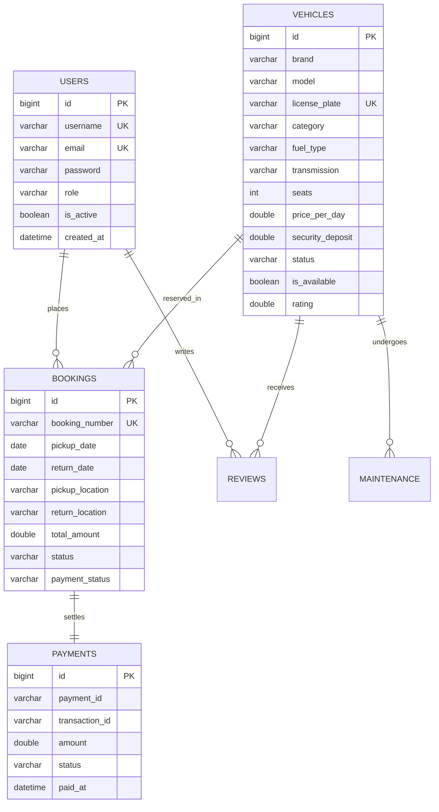

# AutoDrive - Enterprise Car Rental Application
> **Task ID:** JV-BN-002  
> **Domain:** Car Rental & Fleet Mobility  
> **Internship Track:** Java Full-Stack Internship  
> **Architecture:** Spring Boot 3.x, Spring Data JPA, Spring Security, MySQL 8.x, Thymeleaf, Bootstrap 5  

---

## 1. Project Overview

**AutoDrive** is a production-grade, full-stack web application designed for comprehensive automotive rental management. The platform provides an end-to-end booking lifecycle for retail customers alongside an administrative command center for fleet operations, reservation dispatch, maintenance scheduling, and financial auditing.

### Key Highlights
- **Strict Vehicle Availability & Conflict Engine:** Prevents double bookings using interval overlap calculations (`start1 <= end2 AND end1 >= start2`).
- **Role-Based Access Control (RBAC):** Distinct `CUSTOMER` and `ADMIN` authorization with `BCryptPasswordEncoder` encrypted credentials and protected routes.
- **Resilient Payment Architecture:** Pluggable sandbox test gateway supporting Stripe / Razorpay patterns with simulated success and decline outcomes without external API dependencies.
- **Electronic Invoicing:** Automated itemized invoice generation with instantaneous browser printing (`window.print()`) and downloadable HTML receipts.
- **Fleet Maintenance Synchronization:** Vehicle maintenance records automatically transition vehicle availability out of the booking catalog while servicing is underway.
- **Verified Customer Ratings:** Completed rentals allow customers to publish 1-5 star ratings and reviews which dynamically recalculate fleet averages.

---

## 2. Technology Stack

| Layer | Technologies |
| :--- | :--- |
| **Backend Framework** | Java 17+, Spring Boot 3.2.4 (Spring Web, Spring Data JPA, Spring Security 6) |
| **ORM / Persistence** | Hibernate 6, Jakarta Persistence API (JPA) |
| **Database** | MySQL 8.x (Production/Development), Flyway Migrations, H2 Database (In-Memory Testing) |
| **Template Engine** | Thymeleaf 3 with `thymeleaf-extras-springsecurity6` |
| **Frontend UI** | HTML5, CSS3 (Custom Design System), Bootstrap 5.3, Font Awesome 6, JavaScript |
| **Security** | Spring Security with BCrypt password hashing, CSRF protection, and session management |
| **Testing** | JUnit 5, Mockito, Spring Boot Test (`@SpringBootTest`, `MockMvc`) |
| **Build & Tooling** | Apache Maven |

---

## 3. System Architecture & Project Structure

The project strictly follows layered architecture principles:

```
src/main/java/com/example/carrental/
├── config/              # Security filter chain, authentication handlers, web MVC config
├── controller/          # Spring MVC & REST controllers (Home, Auth, Vehicle, Booking, Payment, Admin)
├── dto/                 # Data Transfer Objects with Jakarta Validation constraints
├── entity/              # JPA Entities (User, Vehicle, Booking, Payment, Review, Maintenance, Enums)
├── exception/           # Custom exceptions & @ControllerAdvice centralized exception handler
├── repository/          # Spring Data JPA repositories with custom JPQL queries
├── security/            # CustomUserDetails, CustomUserDetailsService, SuccessHandler
├── service/             # Service contracts & business abstractions
│   └── impl/            # Transactional implementations (@Service, @Transactional)
└── util/                # Booking number generator, date overlap helper, sample data runner
```

---

## 4. Database Schema & Entities

The relational database schema is structured as follows:



### Database Tables:
1. `users`: Stores credentials, contact details, driver's license, and `Role` (`CUSTOMER`, `ADMIN`).
2. `vehicles`: Fleet inventory with technical specifications, pricing, security deposit, availability flag, and status (`AVAILABLE`, `RENTED`, `MAINTENANCE`).
3. `bookings`: Reservation records with itinerary dates, locations, total charges, and statuses (`PENDING`, `CONFIRMED`, `ACTIVE`, `COMPLETED`, `CANCELLED`).
4. `payments`: Financial ledger tracking payment method, transaction IDs, timestamps, and statuses (`PENDING`, `SUCCESS`, `FAILED`).
5. `reviews`: Customer ratings (1-5 stars) and comments linked to vehicles and users.
6. `maintenance`: Servicing logs (`OIL_CHANGE`, `TIRE_ROTATION`, `REPAIR`, `INSPECTION`) with status (`SCHEDULED`, `IN_PROGRESS`, `COMPLETED`).

---

## 5. Vehicle Availability & Conflict Logic

When a customer selects a pickup date, return date, and vehicle, the application executes a mathematical overlap query:

$$\text{Existing Booking: } [P_1, R_1], \quad \text{Requested Booking: } [P_2, R_2]$$
$$\text{Conflict Condition: } P_1 \le R_2 \quad \text{AND} \quad R_1 \ge P_2$$

- **Blocking Statuses:** `PENDING`, `CONFIRMED`, `ACTIVE`.
- **Non-blocking Statuses:** `CANCELLED` bookings do not obstruct availability.
- **Fleet Constraints:** Vehicles marked with status `MAINTENANCE` or `isAvailable = false` are blocked unconditionally.
- **Date Constraints:** Return date prior to pickup date, same-day invalid ranges, or past pickup dates are rejected with meaningful validation errors.

---

## 6. Development Credentials (Seed Data)

The application automatically seeds safe sample data on initial startup:

| Role | Username | Email | Password | Access Level |
| :--- | :--- | :--- | :--- | :--- |
| **Administrator** | `admin` | `admin@autodrive.com` | `admin123` | Full Admin Dashboard, Fleet CRUD, User toggling, Financial logs |
| **Customer 1** | `customer` | `john.doe@example.com` | `customer123` | Vehicle Booking, Profile Management, Order History, Reviewing |
| **Customer 2** | `sarah` | `sarah.connor@example.com` | `customer123` | Vehicle Booking, Order History |

*Note: Passwords are encrypted using BCrypt (`$2a$10$...`) and are provided for local development/testing evaluation.*

---

## 7. Setup & Execution Instructions

### Prerequisites
- **Java:** JDK 17 or higher (`java -version`)
- **Maven:** Apache Maven 3.8+ (`mvn -version`)
- **MySQL:** MySQL Server 8.0+

### Step 1: Create MySQL Database
Log in to your local MySQL server and create the application database:
```sql
CREATE DATABASE carrental_db CHARACTER SET utf8mb4 COLLATE utf8mb4_unicode_ci;
```

### Step 2: Configure Database Credentials
You can configure database credentials either in `src/main/resources/application.properties` or via standard environment variables:

```bash
# Windows PowerShell
$env:DB_URL="jdbc:mysql://localhost:3306/carrental_db?createDatabaseIfNotExist=true&useSSL=false&serverTimezone=UTC&allowPublicKeyRetrieval=true"
$env:DB_USERNAME="root"
$env:DB_PASSWORD="YOUR_MYSQL_PASSWORD"

# Linux / macOS
export DB_URL="jdbc:mysql://localhost:3306/carrental_db?createDatabaseIfNotExist=true&useSSL=false&serverTimezone=UTC&allowPublicKeyRetrieval=true"
export DB_USERNAME="root"
export DB_PASSWORD="YOUR_MYSQL_PASSWORD"
```

### Step 3: Run the Application
From the project root directory:
```bash
mvn spring-boot:run
```

Once started, navigate your browser to:
```
http://localhost:8080
```

---

## 8. Build & Testing

### Run Automated Tests
All unit and integration tests run using an isolated in-memory H2 database, requiring no live MySQL connection during test execution:
```bash
mvn clean test
```

### Build Production JAR Package
```bash
mvn clean package
```
The compiled executable JAR will be generated at:
```
target/car-rental-app-1.0.0.jar
```

To run the packaged JAR directly:
```bash
java -jar target/car-rental-app-1.0.0.jar
```

---

## 9. Payment Architecture & Sandbox Testing

AutoDrive features a zero-credential mock payment sandbox architecture:
- **Sandbox Outcome Switcher:** On the checkout screen (`/payment/{id}`), select either:
  - **Simulate SUCCESSFUL Payment:** Generates a unique transaction reference (`TXN-...`), marks payment as `SUCCESS`, updates booking to `CONFIRMED`, and unlocks the invoice.
  - **Simulate DECLINED Payment:** Simulates an issuer decline, marks transaction as `FAILED`, leaves reservation in `PENDING`, and provides a retry link.
- **Production Extension:** Environment variables `PAYMENT_PROVIDER`, `PAYMENT_KEY_ID`, and `PAYMENT_KEY_SECRET` allow straightforward activation of live Razorpay or Stripe merchant gateways.

---

## 10. Application Pages & Endpoints

### Public Pages
- `GET /` — Homepage with Hero, Live Search Widget, Featured Cars, and Why Choose Us
- `GET /vehicles` — Fleet catalog with multi-facet filters (Category, Fuel, Transmission, Seats, Price, Dates)
- `GET /vehicles/{id}` — Vehicle details, specifications, verified customer ratings, and live availability check
- `GET /about` — Mission and company standards
- `GET /contact` — Customer care inquiry form
- `GET /terms` — Rental policy and deposit terms
- `GET /login` — Authentication page with Quick-Fill demo credentials
- `GET /register` — Customer account registration

### Customer Portal
- `GET /dashboard` — Customer dashboard with statistics and recent bookings
- `GET /my-bookings` — Comprehensive rental history table
- `GET /my-bookings/{id}` — Booking itinerary details with review submission form
- `GET /profile` — Customer personal details and contact settings
- `GET /invoice/{id}` — Official HTML invoice view with printable layout
- `GET /invoice/{id}/download` — Direct download of HTML invoice receipt

### Booking & Payment Flow
- `GET /bookings/new` — Step 1: Itinerary and driver confirmation
- `POST /bookings` — Create booking with price calculation
- `GET /payment/{bookingId}` — Step 2: Payment checkout and sandbox simulator
- `POST /payment/process` — Gateway execution
- `GET /payment/success` — Step 3: Transaction confirmation receipt
- `GET /payment/failed` — Declined payment resolution

### Administrative Console
- `GET /admin/dashboard` — Operational KPIs (Vehicles, Bookings, Revenue, Users, Alerts)
- `GET /admin/vehicles` — Vehicle fleet inventory table
- `GET /admin/vehicles/add` — Add new vehicle form
- `GET /admin/vehicles/edit/{id}` — Edit vehicle specifications
- `POST /admin/vehicles/status/{id}` — Transition vehicle status (`AVAILABLE`, `RENTED`, `MAINTENANCE`)
- `POST /admin/vehicles/toggle/{id}` — Toggle active visibility in public catalog
- `GET /admin/bookings` — Booking management and status dispatcher
- `GET /admin/users` — Customer accounts table with lock/unlock actions
- `GET /admin/payments` — Financial ledger and transaction logs
- `GET /admin/maintenance` — Fleet servicing scheduling and cost tracking

---

## 11. Screenshots Section Placeholder

| View | Description |
| :--- | :--- |
| **Homepage & Search** | Modern hero with real-time pickup/return date availability picker |
| **Fleet Catalog** | Filter sidebar with category chips, badges, and responsive vehicle cards |
| **Checkout Flow** | 3-step checkout with itemized daily rate and deposit calculation |
| **Payment Sandbox** | Secure checkout screen with simulated payment outcome controls |
| **Customer Dashboard** | Rental statistics, active reservations, and download invoice links |
| **Admin Operations** | Fleet analytics, revenue charts, and dispatch controls |

---

## 12. Future Improvements
- Multi-currency conversion via live exchange rate APIs.
- GPS telematics tracking integration for real-time fleet vehicle mileage.
- Automated email dispatch of PDF invoices using Spring Mail & Thymeleaf email templates.
- Self-service pickup mobile app using Bluetooth vehicle unlocking.
